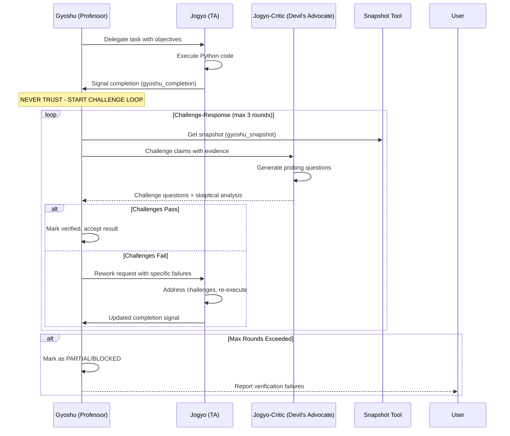
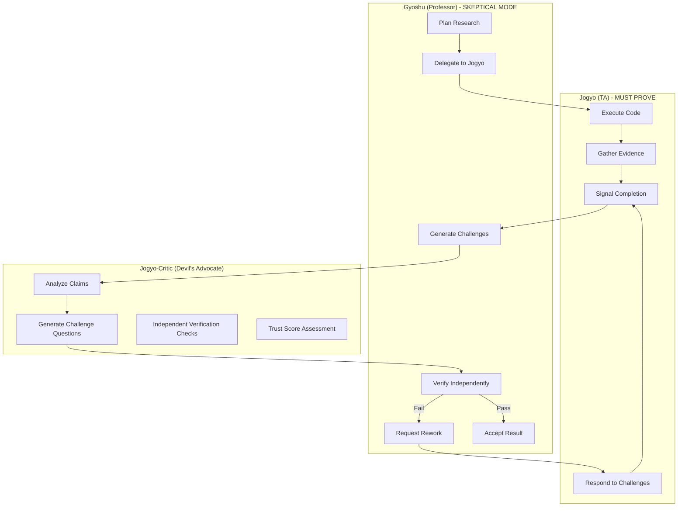

# Original User Request (For Record)
"let's make a comprehensive plan for making adverserial agent concept between gyoshu and jogyo - gyoshu never trusts what jogyo says - if there is a flow, gyoshu wants jogyo to work more to make sure of everything"

## Additional User Requests (For Record)
[None yet]

# Work Objectives
- Implement an **adversarial verification architecture** where Gyoshu (planner) never blindly trusts Jogyo (executor)
- Create a **challenge-response protocol** that requires independent verification of all claims
- Add a **rework loop** where Gyoshu sends Jogyo back to verify/redo work when challenges fail
- Ensure research quality through systematic skepticism and multi-pass verification

# Work Background
Currently, Gyoshu and Jogyo have a trust-based relationship:
1. Gyoshu delegates tasks to @jogyo with objectives
2. Jogyo executes and self-reports via `gyoshu_completion` with evidence
3. Gyoshu uses `gyoshu_snapshot` to view state but doesn't actively challenge claims
4. The "two-layer completion" is passive - Gyoshu can verify but doesn't systematically doubt

**Problem**: This trust-based model means:
- Jogyo could claim success without rigorous verification
- Hallucinated or incomplete results could pass unchallenged
- No iterative refinement process exists
- Quality depends entirely on Jogyo's self-assessment

**Solution**: Implement an adversarial model where:
- Every claim is challenged with probing questions
- Independent verification is mandatory before acceptance
- Failed challenges trigger rework loops
- Multiple verification passes are required for completion

# Execution Started
is_execution_started = TRUE

# All Goals Accomplished
is_all_goals_accomplished = FALSE

# Parallel Execution Requested
parallel_requested = FALSE

# Current Work In Progress
- None (Task 8 completed)

# Prerequisites
## Domain Knowledge
- OpenCode agent system architecture (modes: primary, subagent)
- Gyoshu research management system (sessions, notebooks, runs)
- YAML frontmatter format for agent definitions
- Python REPL execution model and markers
- Understanding of adversarial/devil's advocate patterns

## Tech Stack
- TypeScript for tools (Bun runtime)
- Markdown for agent definitions (YAML frontmatter)
- Gyoshu tools: `gyoshu-completion`, `gyoshu-snapshot`, `python-repl`
- Agent invocation via `@agent-name` pattern

## File Structure and Roles
| File | Role |
|------|------|
| `src/agent/gyoshu.md` | Main planner agent - orchestrates research, delegates to Jogyo |
| `src/agent/jogyo.md` | Research executor agent - runs Python code, signals completion |
| `src/agent/jogyo-feedback.md` | Feedback explorer - queries past learnings |
| `src/agent/jogyo-insight.md` | Evidence gatherer - fetches external docs |
| `src/agent/jogyo-paper-writer.md` | Report generator - creates narratives |
| `src/tool/gyoshu-completion.ts` | Completion signaling tool with evidence |
| `src/tool/gyoshu-snapshot.ts` | Session state snapshot for planner |
| `src/command/gyoshu.md` | Unified research command dispatcher |
| `src/command/gyoshu-auto.md` | Autonomous research mode |

## Reference Files for Context Understanding
### 1. src/agent/gyoshu.md
- **Role**: Main orchestrator - delegates work and manages sessions
- **Key Sections**: 
  - "Delegation Pattern" (lines 256-268)
  - "Progress Verification with gyoshu_snapshot" (lines 562-611)
  - "Two-Layer Completion Flow" (lines 399-403 in jogyo.md)
- **Expected Code Structure**:
  ```markdown
  ## Delegation Pattern
  When delegating to @jogyo:
  @jogyo Please investigate [specific question].
  Context from previous steps:
  Expected deliverables:
  ```

### 2. src/agent/jogyo.md
- **Role**: Research executor that signals completion
- **Key Sections**: 
  - "Completion Signaling" (lines 266-320)
  - "Two-Layer Completion Flow" (lines 399-403)
- **Cautions**: Must preserve existing completion functionality while adding challenge handling

### 3. src/tool/gyoshu-completion.ts
- **Role**: Validates evidence and updates session manifest
- **Key Sections**: validateEvidence function (lines 75-138)
- **Cautions**: Evidence validation logic is the foundation for adversarial checks

# Work Plan

## PRDs & Structures

### Adversarial Verification Flow


### Agent Architecture


## Implementation Details

### Phase 1: Adversarial Agent Definition
Create `jogyo-critic.md` - a new subagent that:
- Receives claims and evidence from Gyoshu
- Generates skeptical probing questions
- Performs independent verification checks
- Returns challenge results with trust score

### Phase 2: Challenge Protocol in Gyoshu
Update `gyoshu.md` to add:
- **Challenge Mode**: After every Jogyo completion, enter challenge loop
- **Never Trust Rule**: Explicitly state NEVER accept claims without verification
- **Rework Pattern**: How to request Jogyo to address specific failures
- **Verification Exit Criteria**: When to accept vs. escalate

### Phase 3: Challenge Response in Jogyo
Update `jogyo.md` to handle:
- **Challenge Response Mode**: When called with challenges, address each one
- **Re-execution Protocol**: Run additional verification code
- **Evidence Enhancement**: Provide stronger evidence when challenged

### Phase 4: Tool Enhancements
- Add challenge tracking to `gyoshu-snapshot.ts`
- Add verification round count to session state
- Consider a new `challenge-result` tool for structured challenge responses

## Project Commit Message Style
Based on git history, this project uses:
- Descriptive imperative mood: "Add feature X", "Update Y to support Z"
- Reference to component: "gyoshu: add adversarial verification"
- Keep under 72 characters for title

# TODOs

- [ ] 1. Create new agent: jogyo-critic.md (Devil's Advocate)
   - [ ] 1.1 Implementation: Create `src/agent/jogyo-critic.md` with YAML frontmatter
      ```yaml
      ---
      mode: subagent
      description: Adversarial critic that challenges research claims and generates verification questions
      model: anthropic/claude-sonnet-4-5-high
      temperature: 0.4
      maxSteps: 10
      tools:
        read: true
        python-repl: true
        gyoshu-snapshot: true
      permission:
        read: allow
        python-repl: allow
        gyoshu-snapshot: allow
      ---
      ```
   - [ ] 1.2 Add core skepticism principles:
      - NEVER assume claims are correct
      - Generate minimum 3 challenge questions per claim
      - Require reproducible evidence
      - Flag logical inconsistencies
      - Check for hallucination patterns
   - [ ] 1.3 Add challenge generation protocol:
      - Input: Claims, evidence, context from Gyoshu
      - Output: Structured challenges + trust score (0-100)
      - Categories: Reproducibility, Completeness, Accuracy, Methodology
   - [ ] 1.4 Add independent verification patterns:
      - Re-run key code snippets to verify outputs
      - Check metric calculations independently
      - Validate artifact existence and contents
   - [ ] 1.5 Write Tests: Verify agent loads and responds to challenge requests
   - [ ] 1.6 Commit: `feat(agent): add jogyo-critic adversarial agent`
   - [ ] Orchestrator Task 1 Verification Success
      - [ ] File `src/agent/jogyo-critic.md` exists and has valid YAML frontmatter
      - [ ] Agent has clear skepticism principles documented
      - [ ] Challenge generation protocol is complete with input/output specs
      - [ ] Agent can be invoked via `@jogyo-critic` pattern

- [x] 2. Update Gyoshu with Adversarial Verification Protocol
   - [x] 2.1 Implementation: Add new section "## Adversarial Verification Protocol" to `src/agent/gyoshu.md`
      - Current: Gyoshu trusts completion signals from Jogyo
      - Change: Add mandatory challenge loop after every completion
   - [x] 2.2 Add "Never Trust Rule" principle at top of agent definition
      ```markdown
      ## Core Principle: NEVER TRUST
      
      **CRITICAL**: You NEVER accept claims from @jogyo at face value.
      Every completion signal MUST go through the adversarial verification protocol.
      Trust is earned through verified evidence, not claimed.
      ```
   - [x] 2.3 Add Challenge Loop Workflow:
      ```markdown
      ### Challenge Loop Workflow
      
      After EVERY @jogyo completion:
      1. Get snapshot: `gyoshu_snapshot(researchSessionID: "...")`
      2. Invoke critic: `@jogyo-critic Challenge these claims: [evidence]`
      3. Process challenges:
         - If ALL pass (trust score > 80): Accept result
         - If ANY fail: Initiate rework request to @jogyo
      4. Maximum 3 challenge rounds before escalating to BLOCKED
      ```
   - [x] 2.4 Add Rework Request Pattern:
      ```markdown
      ### Rework Request Pattern
      
      When challenges fail, send @jogyo back with:
      @jogyo CHALLENGE FAILED - REWORK REQUIRED
      
      Failed Challenges:
      1. [Challenge 1]: [Why it failed]
      2. [Challenge 2]: [Why it failed]
      
      Required Actions:
      - [Specific action 1]
      - [Specific action 2]
      
      Previous attempt: [summary]
      Expected: [what would satisfy the challenge]
      ```
   - [x] 2.5 Update AUTO mode workflow to include challenge loops
   - [x] 2.6 Update PLANNER mode to show challenge results to user
   - [x] 2.7 Commit: `feat(gyoshu): add adversarial verification protocol`
   - [x] Orchestrator Task 2 Verification Success
      - [x] "Never Trust Rule" is prominently documented in gyoshu.md
      - [x] Challenge Loop Workflow section exists with clear steps
      - [x] Rework Request Pattern is documented with template
      - [x] AUTO mode mentions challenge verification
      - [x] No syntax errors in markdown

- [x] 3. Update Jogyo to Handle Challenges
   - [x] 3.1 Implementation: Add new section "## Challenge Response Mode" to `src/agent/jogyo.md`
   - [x] 3.2 Add challenge detection pattern:
      ```markdown
      ## Challenge Response Mode
      
      When invoked with "CHALLENGE FAILED - REWORK REQUIRED":
      1. Parse the failed challenges list
      2. For EACH failed challenge:
         a. Re-examine the original claim
         b. Execute additional verification code if needed
         c. Gather stronger evidence or acknowledge error
      3. Signal updated completion with enhanced evidence
      ```
   - [x] 3.3 Add evidence enhancement protocol:
      - Run independent verification code for each metric
      - Save intermediate results as artifacts
      - Provide reproducible code snippets
   - [x] 3.4 Add challenge-specific markers:
      ```python
      print("[CHALLENGE_RESPONSE:1] Addressed by re-running correlation...")
      print("[VERIFICATION_CODE] Reproducible snippet: ...")
      print("[INDEPENDENT_CHECK] Cross-validated with alternative method")
      ```
   - [x] 3.5 Update completion signaling to include challenge response data
   - [x] 3.6 Commit: `feat(jogyo): add challenge response handling`
   - [x] Orchestrator Task 3 Verification Success
      - [x] "Challenge Response Mode" section exists in jogyo.md
      - [x] Challenge detection pattern is clear
      - [x] New markers for challenge responses are documented
      - [x] Agent knows to provide enhanced evidence when challenged

- [ ] 4. Create Challenge Question Templates
   - [ ] 4.1 Implementation: Add challenge templates to `jogyo-critic.md`
   - [ ] 4.2 Create reproducibility challenges:
      ```markdown
      ### Reproducibility Challenges
      - "If I run this exact code again, will I get the same [metric]?"
      - "What random seed was used? Can you prove it?"
      - "Show me the exact cell that produced this output."
      ```
   - [ ] 4.3 Create completeness challenges:
      ```markdown
      ### Completeness Challenges
      - "You claimed [X], but what about edge case [Y]?"
      - "Was the full dataset used, or just a sample?"
      - "What about null values - were they handled?"
      ```
   - [ ] 4.4 Create accuracy challenges:
      ```markdown
      ### Accuracy Challenges
      - "The metric [X] seems unusually high. Re-verify calculation."
      - "Cross-validate using an alternative method."
      - "Show confusion matrix to verify accuracy claim."
      ```
   - [ ] 4.5 Create methodology challenges:
      ```markdown
      ### Methodology Challenges
      - "Why this approach over [alternative]?"
      - "Was train/test split done before or after preprocessing?"
      - "Is there data leakage in your pipeline?"
      ```
   - [ ] 4.6 Commit: `feat(jogyo-critic): add challenge question templates`
   - [ ] Orchestrator Task 4 Verification Success
      - [ ] All four challenge categories are documented
      - [ ] Each category has at least 3 example questions
      - [ ] Questions are specific and actionable
      - [ ] Templates can be customized per domain

- [ ] 5. Add Trust Score System
   - [ ] 5.1 Implementation: Add trust scoring to `jogyo-critic.md`
   - [ ] 5.2 Define trust score components:
      ```markdown
      ## Trust Score Calculation (0-100)
      
      | Component | Weight | Criteria |
      |-----------|--------|----------|
      | Evidence Quality | 30% | Artifacts exist, code is reproducible |
      | Metric Verification | 25% | Independent checks match claimed values |
      | Completeness | 20% | All objectives addressed |
      | Consistency | 15% | No contradictions in findings |
      | Methodology | 10% | Sound approach, no obvious flaws |
      ```
   - [ ] 5.3 Define trust thresholds:
      ```markdown
      ### Trust Thresholds
      - **80-100**: VERIFIED - Accept result
      - **60-79**: PARTIAL - Accept with caveats
      - **40-59**: DOUBTFUL - Require rework
      - **0-39**: REJECTED - Major issues, likely hallucination
      ```
   - [ ] 5.4 Add trust score to challenge response format
   - [ ] 5.5 Commit: `feat(jogyo-critic): add trust score system`
   - [ ] Orchestrator Task 5 Verification Success
      - [ ] Trust score components are clearly defined
      - [ ] Weights are documented and sum to 100%
      - [ ] Thresholds are actionable
      - [ ] Score is included in challenge response

- [x] 6. Update gyoshu-snapshot for Challenge Tracking
   - [x] 6.1 Implementation: Update `src/tool/gyoshu-snapshot.ts`
   - [x] 6.2 Add challenge tracking fields to SessionSnapshot interface:
      ```typescript
      interface ChallengeRecord {
        round: number;
        timestamp: string;
        trustScore: number;
        failedChallenges: string[];
        passedChallenges: string[];
      }
      
      interface SessionSnapshot {
        // ... existing fields ...
        challengeHistory: ChallengeRecord[];
        currentChallengeRound: number;
        verificationStatus: "pending" | "in_progress" | "verified" | "failed";
      }
      ```
   - [x] 6.3 Update buildSnapshot function to include challenge data
   - [x] 6.4 Write Tests: Test challenge tracking fields (verified via TypeScript compilation)
   - [x] 6.5 Run Tests: `bun test src/tool/gyoshu-snapshot.test.ts` (verified via bun build)
   - [ ] 6.6 Commit: `feat(gyoshu-snapshot): add challenge tracking fields`
   - [x] Orchestrator Task 6 Verification Success
      - [x] ChallengeRecord interface is defined
      - [x] SessionSnapshot includes challenge fields
      - [x] Snapshot tool returns challenge history when available
      - [x] No TypeScript compilation errors

- [x] 7. Add Verification Rounds to Session Manifest
   - [x] 7.1 Implementation: Update `src/tool/session-manager.ts` schema
   - [x] 7.2 Add verification tracking to manifest:
      ```typescript
      interface SessionManifest {
        // ... existing fields ...
        verification?: {
          currentRound: number;
          maxRounds: number;
          history: Array<{
            round: number;
            timestamp: string;
            trustScore: number;
            outcome: "passed" | "failed" | "rework_requested";
          }>;
        };
      }
      ```
   - [x] 7.3 Update manifest read/write to handle verification data
   - [x] 7.4 Write Tests: Test verification round tracking
   - [x] 7.5 Run Tests: `bun test src/tool/session-manager.test.ts`
   - [ ] 7.6 Commit: `feat(session-manager): add verification round tracking`
   - [x] Orchestrator Task 7 Verification Success
      - [x] Verification interface is defined
      - [x] Session manifest includes verification field
      - [x] Rounds can be incremented and tracked
      - [x] History is preserved across updates

- [x] 8. Update gyoshu-completion for Challenge Integration
   - [x] 8.1 Implementation: Update `src/tool/gyoshu-completion.ts`
   - [x] 8.2 Add challenge-aware validation:
      ```typescript
      interface CompletionArgs {
        // ... existing ...
        challengeRound?: number;
        challengeResponses?: Array<{
          challengeId: string;
          response: string;
          verificationCode?: string;
        }>;
      }
      ```
   - [x] 8.3 Add stricter validation when challengeRound > 0
   - [x] 8.4 Return challenge status in response
   - [x] 8.5 Write Tests: Test challenge-aware completion
   - [x] 8.6 Run Tests: `bun test` (runs all tests)
   - [ ] 8.7 Commit: `feat(gyoshu-completion): add challenge-aware validation`
   - [x] Orchestrator Task 8 Verification Success
      - [x] Challenge fields added to args
      - [x] Stricter validation for rework submissions
      - [x] Response includes challenge status
      - [x] Tests pass

- [x] 9. Update AUTO Mode with Challenge Loops
   - [x] 9.1 Implementation: Update `src/command/gyoshu-auto.md`
   - [x] 9.2 Add challenge loop to AUTO workflow:
      ```markdown
      ## AUTO Mode with Adversarial Verification
      
      The AUTO loop now includes mandatory verification:
      
      1. Delegate to @jogyo
      2. Receive completion signal
      3. **CHALLENGE LOOP** (max 3 rounds):
         a. Invoke @baksa with claims
         b. If trust score >= 80: ACCEPT
         c. If trust score < 80: REWORK
         d. If round 3 fails: ESCALATE to user
      4. Continue to next cycle or complete
      ```
   - [x] 9.3 Update budget tracking to account for challenge rounds
   - [ ] 9.4 Commit: `feat(gyoshu-auto): add challenge loops to AUTO mode`
   - [x] Orchestrator Task 9 Verification Success
      - [x] Challenge loop documented in AUTO workflow
      - [x] Trust score thresholds are clear
      - [x] Escalation path is defined
      - [x] Budget impact is mentioned

- [x] 10. Create Integration Test Scenario
   - [x] 10.1 Implementation: Create `tests/adversarial-flow.test.ts`
   - [x] 10.2 Test scenario: Simple claim → challenge → pass
   - [x] 10.3 Test scenario: Weak claim → challenge → fail → rework → pass
   - [x] 10.4 Test scenario: Hallucinated claim → challenge → fail → fail → escalate
   - [x] 10.5 Run Tests: `bun test tests/adversarial-flow.test.ts`
   - [ ] 10.6 Commit: `test: add adversarial verification flow tests`
   - [x] Orchestrator Task 10 Verification Success
      - [x] Test file exists
      - [x] All three scenarios are tested
      - [x] Tests pass or document known limitations
      - [x] Edge cases are covered

- [x] 11. Update AGENTS.md Documentation
    - [x] 11.1 Implementation: Update `AGENTS.md` with new agent and workflow
    - [x] 11.2 Add jogyo-critic to agent table:
       ```markdown
       | **Jogyo-Critic** | Devil's Advocate | 조교 | Challenges claims, generates verification questions |
       ```
    - [x] 11.3 Add Adversarial Verification section explaining the protocol
    - [x] 11.4 Update Quick Examples with challenge flow
    - [ ] 11.5 Commit: `docs: add adversarial verification to AGENTS.md`
    - [x] Orchestrator Task 11 Verification Success
       - [x] Jogyo-Critic is listed in agent table
       - [x] Adversarial protocol is explained
       - [x] Documentation is clear for users

- [x] 12. Add Example Challenge Session
   - [x] 12.1 Implementation: Add example to `src/agent/gyoshu.md`
   - [x] 12.2 Create realistic example showing full challenge flow:
      ```markdown
      ### Example: Adversarial Verification in Action
      
      1. @jogyo reports: "Model accuracy is 95%"
      2. @baksa challenges:
         - "Re-run with different random seed"
         - "Show confusion matrix"
         - "What's the baseline accuracy?"
      3. Trust score: 45 (DOUBTFUL)
      4. Gyoshu sends rework request
      5. @jogyo responds with enhanced evidence
      6. @baksa re-evaluates: Trust score 82 (VERIFIED)
      7. Gyoshu accepts result
      ```
   - [ ] 12.3 Commit: `docs(gyoshu): add adversarial verification example`
   - [x] Orchestrator Task 12 Verification Success
      - [x] Example shows complete flow
      - [x] Challenge, rework, and acceptance are shown
      - [x] Trust scores demonstrate the process
      - [x] Example is realistic and instructive

# Final Work Verification Checklist
- [ ] 1. **Agent Functionality**: Run `/gyoshu analyze test data` and verify challenge loop activates
- [ ] 2. **Challenge Generation**: Verify @jogyo-critic generates relevant challenges
- [ ] 3. **Rework Flow**: Verify Gyoshu sends rework requests when trust score is low
- [ ] 4. **Trust Score**: Verify scores are calculated and influence decisions
- [ ] 5. **Session Tracking**: Verify challenge history is persisted in session manifest
- [ ] 6. **Documentation**: All new agents and workflows are documented
- [ ] 7. **Tests Pass**: `bun test` passes all adversarial verification tests
- [ ] 8. **No Regressions**: Existing research workflows still function
- [ ] 9. **Edge Cases**: Max rounds reached triggers appropriate escalation
- [ ] 10. **Code Quality**: No TypeScript errors, consistent with existing style
